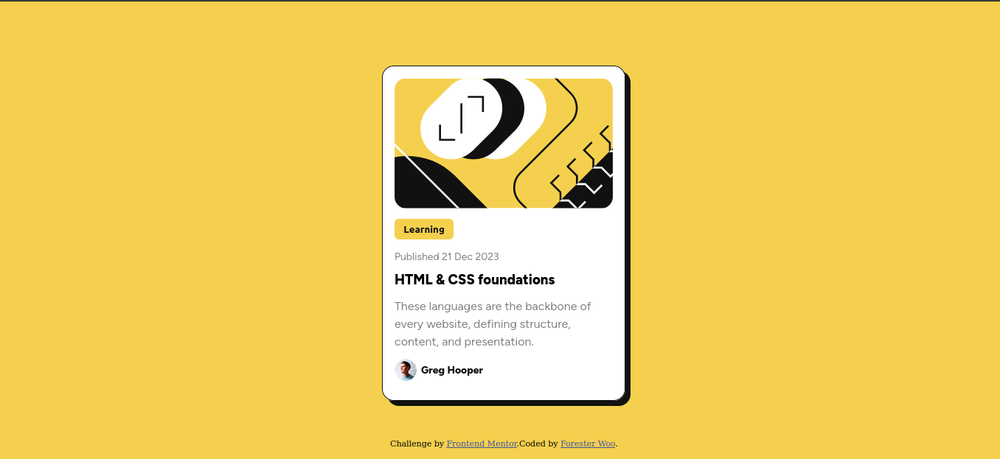
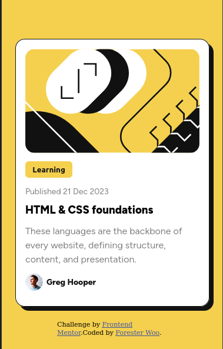

# Frontend Mentor - Blog preview card solution

This is a solution to the [Blog preview card challenge on Frontend Mentor](https://www.frontendmentor.io/challenges/blog-preview-card-ckPaj01IcS). Frontend Mentor challenges help you improve your coding skills by building realistic projects. 

## Table of contents

- [Overview](#overview)
  - [The challenge](#the-challenge)
  - [Screenshot](#screenshot)
  - [Links](#links)
- [My process](#my-process)
  - [Built with](#built-with)
  - [Continued development](#continued-development)
- [Author](#author)
## Overview
The challenge is all about creating a blog preview card that is similar to the design provided.
### The challenge
Blog preview card solution.
Users should be able to:

- See hover and focus states for all interactive elements on the page

### Screenshot

**Desktop-preview**

**Mobile-preview**

### Links

- Solution URL: [Link to Project Repository](https://github.com/Forester04/frontend_mentor-projects/tree/main/blog-preview-card-main)
- Live Site URL: [Live Demo URL](https://forester04.github.io/frontend_mentor-projects/blog-preview-card-main/)

## My process

### Built with

- Semantic HTML5 markup
- CSS custom properties
- Flexbox
- CSS Grid
- Mobile-first workflow

### Continued development
I'll try to implement and include in other projects.

## Author

- Frontend Mentor - [@Forester04](https://www.frontendmentor.io/profile/Forester04)
- Twitter - [@wollf](https://www.twitter.com/wollf)
