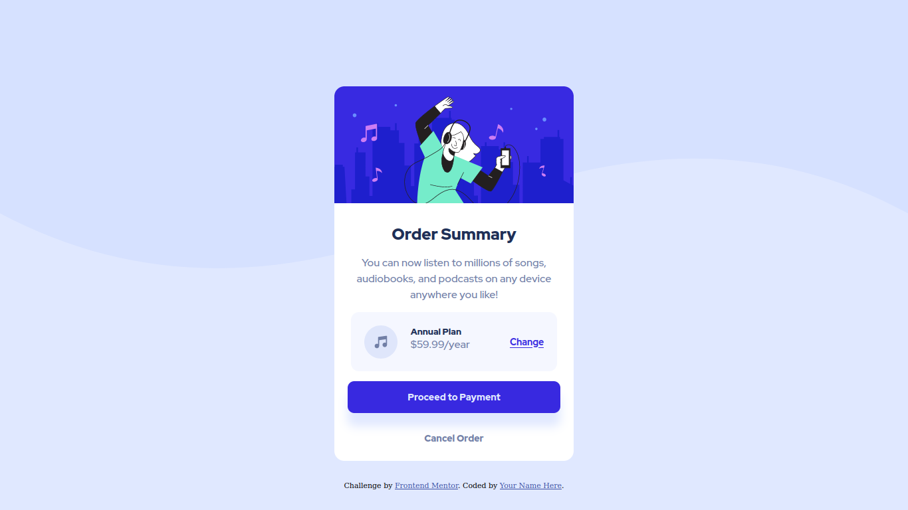

# Frontend Mentor - Order summary card solution

This is a solution to the [Order summary card challenge on Frontend Mentor](https://www.frontendmentor.io/challenges/order-summary-component-QlPmajDUj). Frontend Mentor challenges help you improve your coding skills by building realistic projects. 

## Table of contents

- [Overview](#overview)
  - [The challenge](#the-challenge)
  - [Screenshot](#screenshot)
  - [Links](#links)
- [My process](#my-process)
  - [Built with](#built-with)
- [Author](#author)

## Overview

### The challenge

### Screenshot

**Desktop-preview**

**Mobile-previee**

For the active state of the project kindly click the link in the live demo an feel free to check the active state of this simple order card. Hover the elements to see their active state.

### Links

- Solution URL: [Repository URL](https://github.com/Forester04/frontend_mentor-projects/tree/main/order-summary-component-main)
- Live Site URL: [Live Demo](https://forester04.github.io/frontend_mentor-projects/order-summary-component-main/)

## My process

### Built with

- Semantic HTML5 markup
- CSS custom properties
- Flexbox
- CSS Grid
- Mobile-first workflow

## Author

- Frontend Mentor - [@Forester04](https://www.frontendmentor.io/profile/yourusername)
- Twitter - [@wollf](https://www.twitter.com/yourusername)

