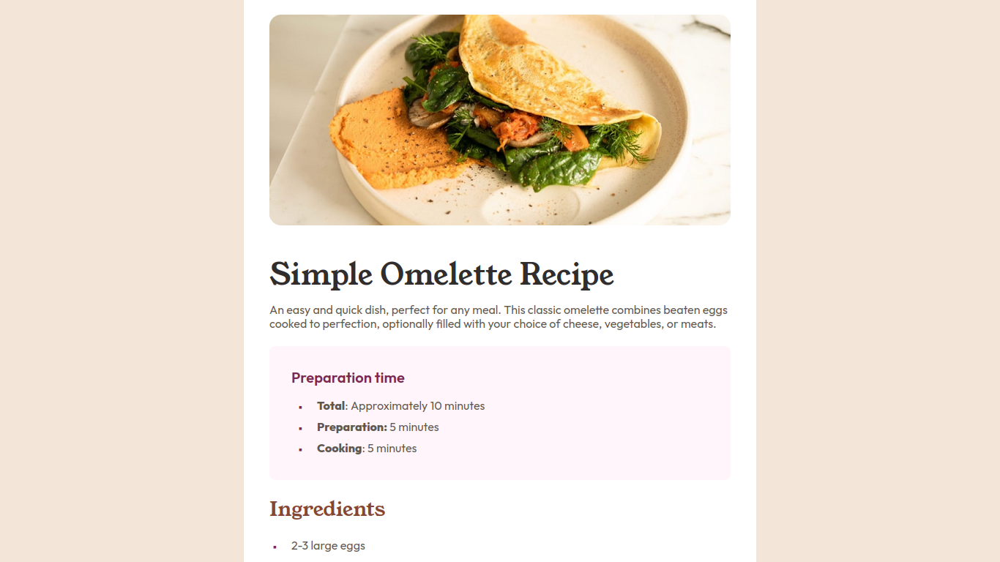
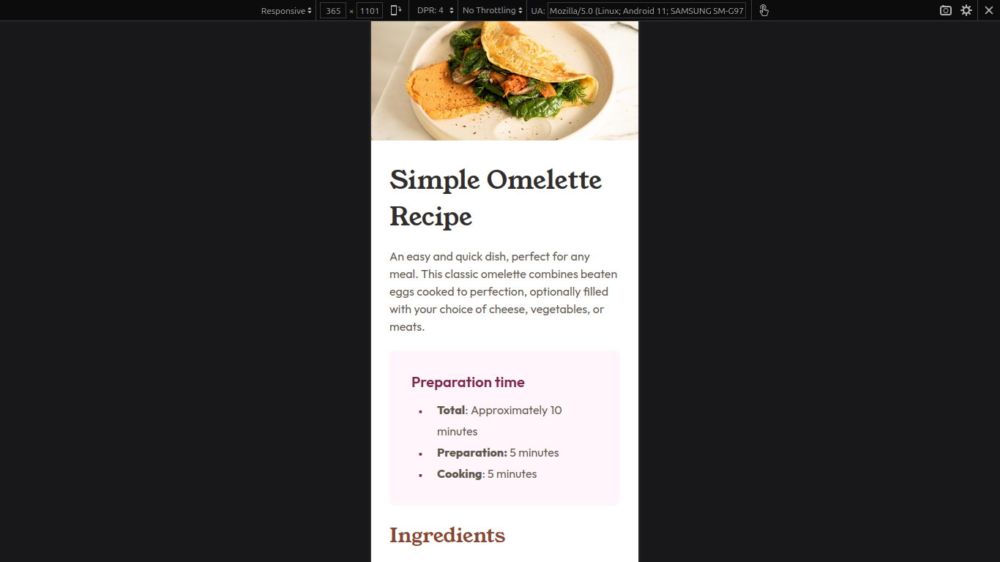

# Frontend Mentor - Recipe Page main

## Challenge Design Preview

This is a solution to the [Recipe Page challenge on Frontend Mentor](https://www.frontendmentor.io/learning-paths/getting-started-on-frontend-mentor-XJhRWRREZd/steps/66ded7ceae82ad43ffce3eb3/challenge/start). Frontend Mentor challenges help you improve your coding skills by building realistic projects. 

## Table of contents

- [Overview](#overview)
  - [The challenge](#the-challenge)
  - [Screenshot](#screenshot)
  - [Links](#links)
- [My process](#my-process)
  - [Built with](#built-with)
  - [Continued development](#continued-development)
- [Author](#author)

## Overview

### The challenge
The task involved creating a responsive and visually appealing user interface (UI) using HTML and CSS on every devices's screen size. The main challenge was to design an interface that not only presented static elements but also dynamically populated results. This required structuring the HTML for efficient content display and utilizing CSS to ensure a user-friendly layout and design.

### Screenshot

#### Desktop Preview

#### Mobile Preview

### Links

- Solution URL: [Link to Project Repository](https://github.com/Forester04/frontend_mentor-projects/tree/main/recipe-page-main)
- Live Site URL: [Live Demo URL](https://forester04.github.io/frontend_mentor-projects/recipe-page-main)

## My process

### Built with

- Semantic HTML5 markup
- CSS custom properties
- Flexbox
- CSS Grid
- Mobile-first workflow

### Continued development
I'll try to implement and include in other projects.

## Author

- Frontend Mentor - [@Forester04](https://www.frontendmentor.io/profile/Forester04)
- Twitter - [@wollf](https://www.twitter.com/wollf)

