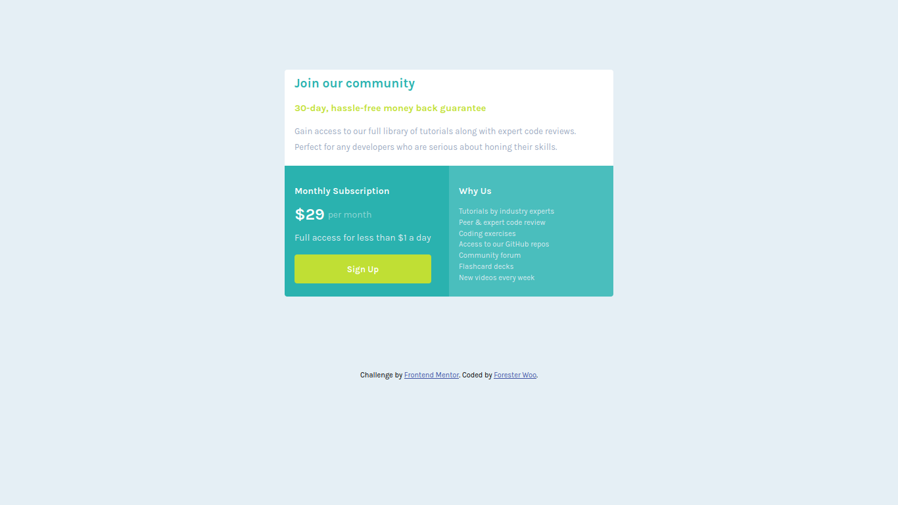

# Frontend Mentor - Single price grid component

This is a solution to the [Product preview card component challenge on Frontend Mentor](https://www.frontendmentor.io/challenges/single-price-grid-component-5ce41129d0ff452fec5abbbc). Frontend Mentor challenges help you improve your coding skills by building realistic projects. 

## Table of contents

- [Overview](#overview)
  - [The challenge](#the-challenge)
  - [Screenshot](#screenshot)
  - [Links](#links)
- [My process](#my-process)
  - [Built with](#built-with)
  - [What I learned](#what-i-learned)
- [Author](#author)

## Overview

### The challenge

Users are be able to:

- View the optimal layout depending on their device's screen size
- The single price component should be responsive across all device.
- See a hover state on desktop for the Sign Up call-to-action

### Screenshot

**Desktop Preview Screenshot**

**Mobile Preview Screenshot**

### Links

- Solution URL: [Repository URL](https://github.com/Forester04/frontend_mentor-projects/tree/main/single-price-grid-component-master)
- Live Site URL: [Live Demo Link](https://forester04.github.io/frontend_mentor-projects/single-price-grid-component-master/)

## My process

### Built with

- Semantic HTML5 markup
- CSS custom properties
- Flexbox
- CSS Grid
- Mobile-first workflow

### What I learned

I learnt to develop this simple project from the Mobile-first Approach. This make my design more responsive than starting your development fromthe desktop as the default and moving towards the mobile preview.

## Author

- Frontend Mentor - [@Forester04](https://www.frontendmentor.io/profile/Forester04)
- Twitter - [@wollf](https://www.twitter.com/wollf)

### I'll really appreciate a code review and a collaboration.🚀
