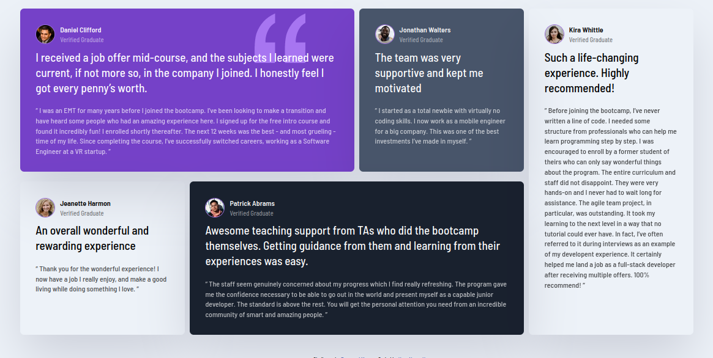

# Frontend Mentor - Testimonials grid section solution

This is a solution to the [Testimonials grid section challenge on Frontend Mentor](https://www.frontendmentor.io/challenges/testimonials-grid-section-Nnw6J7Un7). Frontend Mentor challenges help you improve your coding skills by building realistic projects. 

## Table of contents

- [Overview](#overview)
  - [The challenge](#the-challenge)
  - [Screenshot](#screenshot)
- [My process](#my-process)
  - [Built with](#built-with)
  - [What I learned](#what-i-learned)
  - [Continued development](#continued-development)
- [Author](#author)

## Overview
Testimonials grid   section challenge on Frontend Mentor - This challenge helps improve your knowledge of grid layout.

### The challenge

Users are able to view their solution on the web browser depending on the screen size.

### Screenshot

Screenshot of 1440px screen.

Screenshot of 375px screen size.

## My process

### Built with

- Semantic HTML5 markup
- CSS custom properties
- Flexbox
- CSS Grid
- Mobile-first workflow

### What I learned
I learnt how to use grid for layouts.

### Continued development

I'll try to implement the challenge using other CSS Frameworks, to broaden my knowledge.

## Author

- Forester<erickforester2018@gmail.com>
- Frontend Mentor - [@yourusername](https://www.frontendmentor.io/profile/yourusername)
- Twitter - [@wollf](https://www.twitter.com/wollf)
